# Sideways statistics

This document is about the relationship between four characteristics of linear regressions.  Those characteristics are:

* confidence level
* statistical power
* sample size
* effect size

Those four characteristics are deterministic.  Meaning, if you know any three of them, you can determine the fourth.

Another way to look at the relationship between those four is to think of them as being in balance with each other.  If one of them changes, at least one of the others must also change, in order to maintain the balance. If you are interested in any of those characteristics, you will likely find it helpful to understand the others and the relationship between them.

Most importantly, in my opinion, you need to understand these four and how they are related if you want to properly understand what “statistical significance” actually means, and if you want to avoid fooling yourself into believing that statistical significance alone is evidence evidence of a meaningful result.

I rely heavily on visual representations of concepts to help explain things in this document.  If you are not a “visual thinker”, you may well find the text too sparse to be useful to you.  I do not rely much on equations, rigorous derivations or formal logic.

This document is not meant to be a complete discussion of linear regression or related methods.  Not only is focused on a narrow range of applications of regression it also does not consider all possible cases.

I came up with the graphics and explanations in this document to help myself understand the relationship between statistical significance, statistical power, sample size, and effect size.  I don't expect or intend them to do anything more than that.  But, I am hoping that they can help other people to understand those four features of linear regressions, too.

## Why sideways?

I've called this “Sideways statistics” because of the graphics I created to help myself understand the four deterministic features of linear regressions.  So, let's get to the graphics.

The first graph (figure NN) is a standard probability curve.  Hopefully you've seen it before, because I'm just going to do a quick review of what it means.

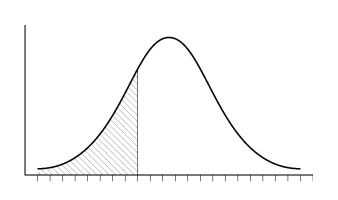

The horizontal axis is the possible values for some measure.  The vertical axis is the probability of getting the value on the horizontal axis when you make a measurement.  But we aren't usually interested in the probability of a specific value.  Instead we're interested in the probability of getting a result that is bounded by some specific value.  Where “bounded by” means that the result in which we're interested is anything that is, for example, “greater than or equal to” the specific value.  We could also be looking for any of the “less than or equal to” values.

The probability of a result that is bounded by some specific value is equal to the total area under the curve to the appropriate side of that value.  In the example graphic (figure NN), that's the shaded area.

In the case of linear regression, the probability that most people are familiar with is the “*p* value”, a.k.a, “alpha”, “confidence level”, etc.  In the social sciences, the most common value for it is 5%, often reported as “*p*<.05”.

When you're using a null-hypothesis significance test to analyze a sample, a confidence level of 5% means that there is a 5% chance that population correlation is not zero.  You don't know the population correlation because you measured and analyzed a sample of the population.  What you have is the sample correlation.  The population correlation is related to the sample correlation by a probability curve.  

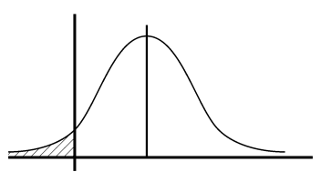

In the next example graphic (figure NN), the mean value of the probability curve is the value of the sample correlation of some hypothetical analysis.  The probability curve shows what values the population correlation may have, based on the sample correlation value. (It also depends on the size of the sample, but we'll get to that later.)  In the example graphic, 5% of the total area under the curve is bounded by a measured value of zero.  So, there is a 5% probability that the population correlation is “less than or equal to” zero.  That's the “null” in “null hypothesis significance testing”.

If you take the previous example graphic and swap the axes, you get the next example (figure NN).  Now, the “null” line is at the bottom of the graph, the horizontal axis is probabilities, and the vertical axis is the value of correlations.  The rest of the visual representations in this document will use this “sideways” arrangement.

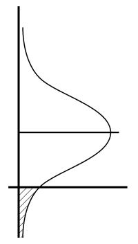

Why is this is a useful convention? Hopefully that will become obvious as you progress through the sections, but I'll give a brief explanation now—don't worry if it doesn't make sense just yet. 

The “sideways” arrangment makes it easier to see the relationship between the four characteristics in question.  On a conventionally arranged graph the probability curves related to *alpha* (confidence level) and *beta* (statistical power) overlap, and it's also more difficult to distinguish between the mean values for the sample correlation and the population correlation.  So, the example graphics are sideways in order to make it easier to keep the various concepts separate and therefore less confusing, yet still see the relationships between them.

## Probability curves and linear regression

Let's say you measure a variety of characteristics of a presumably representative sample of a population.  You can do a linear regression analysis of the measurements, and precisely calculate the correlations between the characteristics you measured.  But, your results are only precise descriptions of the sample.  They aren't precise descriptions of the population, because there is always some amount of error, some amount of potential discrepancy, between the mean value of some characteristic for a sample, and the mean value of that characteristic for the population.

So, you can't precisely determine the correlation between characteristics for the population. But what you can determine precisely is the probability that the population's correlation falls within some range of values.  In the case of null-hypothesis significance testing, your goal is to calculate the probability that the population correlation is above zero.  When you report that a correlation is, e.g., “statistically significant at ‘p<.05’”, you're reporting the probability that you calculated—based on the sample correlation—that the population's correlation is greater than zero.  In the case of ‘p<.05’, that probability is 0.95, in other words, 95%.

You can think about that probability calculation as being a probability curve that you draw around the sample correlation, which you determined from your measurements.  In the example graphic [figure NN], the horizontal line that splits the curve marks the value of the sample correlation.  The probability curve describes the correlation of the population.

This is an important distinction to understand.  In the example graphic [figure NN], the straight line is about the *sample*.  The curve is about the *population*.

The next example graphic [figure NN], is the opposite of that. The straight line is about the *population*.  The curve is about the *sample*.  The probability curve and bisecting line are on the opposite side of the vertical axis from the previous graph because they show the opposite relationship.

What is that relationship?  It's the probability of finding some particular value for a sample correlation, based on what the population correlation is.  Even though you may not be able to ever directly measure the population correlation, it does exist and it does have some precise—if unknown—value.  And that value establishes the probabilities of the sample correlation value you'll determine.

That probability curve is what *beta*, a.k.a. “statistical power”, describes.  But before I explain that, let's back up and review the graphic in which the probability curve is related to the population correlation.    In that graph, the curve is describe by *alpha*, a.k.a., “confidence level”, or “*p* value”.

## Confidence level & Statistical power – alpha & beta

The next example graphic [figure NN] has three curves in it, showing three different values for *alpha*.  The three probability curves are all identical, but the value of the sample correlation increases from left to right.  That increase in the sample correlation shifts the curve upward (in our sideways view) and that means that the value for *alpha* decreases, since the percentage of the area “under” the probability curve that is bounded by the null line decreases.

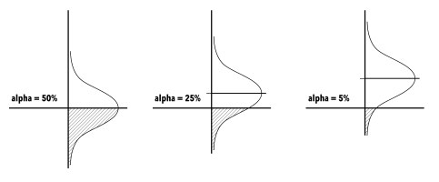

This is what you would expect to happen.  Remember that *alpha*, a.k.a., the “confidence level”, or “*p* value”, indicates the probability that the population correlation is above zero.  Which is another way of saying that it measures the chances that the correlation is “real”, and not an a result of random error.  Yet another way of looking at it is to say that *alpha* is a measure of the chance of making a “Type I” error.

So, the larger the sample correlation is, the less likely it is that no such correlation exists in the population, and that all you have found is random error.  If the sample correlation is quite small, it's easy to believe that the correlation is the result of sampling errors, because it wouldn't take much error to create the illusion of a small correlation.  But it would take a very large and therefore unlikely amount of sampling error to create the illusion of a large correlation.

The next example graphic [figure NN] takes advantage of the sideways arrangment (finally!), and shows both the population and the sample probability curves for some hypothetical linear regression.

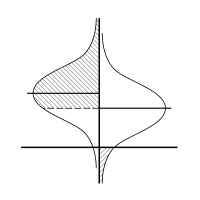

The curve on the **right** is the **population** probability curve, and 5% of its area is below the null line.  Therefore, the line that bisects that curve marks the lowest sample correlation that would be statistically significant at “*p*<.05”.

The curve on the **left** is the **sample** probability curve.  And the shaded portion of its area is the value of the *statistical power* of the analysis.  The unshaded area is the value of *beta*.

On the right side of the graphic, which has the population probability curve, the value of *alpha* is equal to the area bounded by the null line.  On the left side, which has the sample probability curve, the value of *beta* is equal to the area bounded by the line that bisects the curve on the right.  Again, that line is the minimum statistically significant sample correlation at a 95% confidence level.

The line that bisects the sample probability curve on the left side of the graph is the population correlation value.  The probability curve around it describes the sample correlation that you will find.  In the graphic, if we assume that the shaded portion of the area is 60% of the total area, then the graph indicates that if we take a sample of that population and test it for a correlation, there is a 60% chance that we will find a statistically significant correlation (*p*<.05).

In other words, the fact that 60% of the sample correlation probability curve is higher than the minimum statistically significant sample correlation value (*p*<.05), means that there is a 60% chance that the sample correlation we find will be a value that is equal to or greater than that minimum value.

The next example graphic [figure NN] has three graphs in it, with the statistical power increasing from left to right, while *beta* is decreasing.

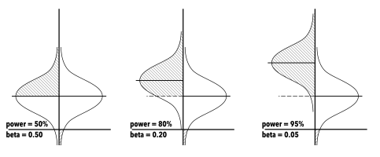

The value for *alpha* is the same for all three graphs, and therefore the minimum sample correlation that is statistically significant is also the same for all three.  The statistical power increases because the population correlation increases.  As it gets higher in the sideways graph, it gets farther away from the minimum statistically significant sample correlation, and therefore the proportion of the area “under” the sample probability curve that has that minimum correlation as a lower bound gets larger.

The shape of the sample probability curve on the left side of the graph perfectly mirrors the shape of the population probability curve on the right side of the graph.  They will always be perfect mirrors, because they are both defined by the same thing: the *sample size*, a.k.a., “N”.

In the next section we'll look at how the shape of those probability is related to sample size.

## Sample size – “N”

The larger the sample size in an analysis the less influence random error has on the sample correlation.  Therefore, the population probability curve that surrounds the sample correlation will be less spread out for larger sample sizes.  The next example graphic [figure NN] represents how the population probability curve tightens as the sample size increases.  The sample size, “N”, increases from left to right for the three examples.

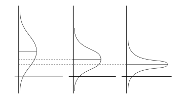

In those three examples, *alpha* is constant, and therefore as the probability curve tightens the line that bisects the probability curve drops closer to the null line.  In other words, at the same confidence level, the larger the sample size is, the lower the minimum correlation that is statistically significant becomes.

This is why one of criticisms of null-hypothesis significance testing is that it ‘doesn't indicate anything other than the fact that a sufficiently large sample was used.’  In other words, *any* non-zero correlation can be statistically significant at *any* confidence level—the only thing you have to do is find a way to increase the sample size far enough.

The next example graphic [figure NN] is a departure from the others, in that it's a graph that is drawn to scale.  It shows the relation between sample size and the minimum statistically significant correlation (*p*<.05).  The relation is what we would expect from the sideways examples—as N get larger, the minimum statistically significant sample correlation drops.

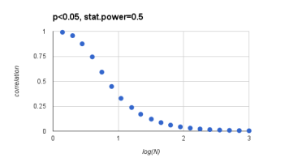

So, we've seen how *alpha* determines the placement of the population probability curve.  We now know that the shape of the population probability curve is determined by *sample size*.  So, between *sample size* and *alpha*, the minimum sample correlation that is statistically significant is determined.  And that minimum correlation sets the lower bound for determining the *statistical power* of the analysis.

Just like with the population probability curve, the shape of the sample probability curve is determined by *sample size*. So with *sample size* and the minimum statistically significant sample correlation that is determined by *sample size* and *alpha* we are almost able to determine the *statistical power*.  All we need to do is figure out where the line that bisects the sample probability curve falls on our sideways graph.

I've been referring to that line as the population correlation.  Because I wanted to maintain symmetry in my descriptions of the sideways statistical graphics.  So, since the right side of the graph has the population probability curve that is bisected by the sample correlation, the left side of the graph which has the sample probability curve should be bisected by something called the “population correlation”.

But that line is also the last of the four characteristics of linear regressions that I set out to discuss—the “effect size”.  That's what the next section will cover.

## Effect size

Descriptions of what the “effect size” is can sometimes be esoteric, but since we've limited ourselves to talking about linear regressions that use null-hypothesis significance testing, we can simply say that it's the correlation that exist in the population.

The somewhat confusing thing is that most of the time we don't know the value of the *effect size*—since if we knew the population correlation, we wouldn't need to be trying to find a sample correlation—yet we need to know its value in order to determine the *statistical power* of an analysis.

One mistake that you might make is to use your sample correlation as an estimate of the population correlation, which is the *effect size*.  Doing that defeats the main purpose of *statistical power*, since you are forcing it to always be 50%.  A *statistical power* of 50% is of effectively no use in avoiding or discussing Type II errors.  

And, regardless of what method you use to determine *effect size*, if you don't use it to calculate *statistical power* until after you've collected and analyzed your data, you've already missed out the chance to you it to help determine the right *sample size* for your study.

Let's go back to the basic example graphic [figure NN] that shows both the population and the sample probability curves for some hypothetical linear regression.

The statistical power is the shaded area “under” the sample probability curve of the left side of the graph.  The size of that area is determined by two things: the shape of the probability curves, and the distance between the lines that bisects the curves.

The two curves are identical, and are a result of the *sample size*.

The height of the line that bisects the population probability curve on the right side of the graph is a result of the shape of the probability curves combined with the *confidence level* of the analysis.

The height of the line that bisects the sample probability curve is the *effect size* of the analysis, a.k.a., the population correlation.

In general, a larger sample size will give you a larger statistical power.  Think of it this way: if the two bisecting lines (the sample and population correlations) are a great distance apart, then even if the probability curves are wide and low, there will be a large area that's between the bisection lines.  But if the two lines are close together, the probability curves will need to be very tight in order to find a large area between the two bisecting lines.  See the next example graphic, [figure NN].

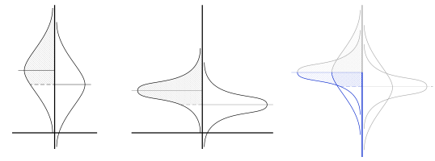

Now that we've gone through the four characteristics and how they're related, we can apply them to our understanding of the two types of error associated linear regressions and null hypothesis significance testing.

## Type I and Type II errors

A Type I error is a “false positive”.  When you find a correlation in a sample that doesn't exist in the population, that's a Type I error.

A Type II error is a “false negative”.  When there is a correlation in a population that you should have found in your sample, but you didn't, that's a Type II error.

The following two sections look at ways to think about those errors in the framework of “sideways statistics”.

### Sideways Type I errors

The example graphic [figure NN] represents a linear regression done at a 95% confidence level.  The population probability curve on the right side of the graph has 5% of its area bounded by null, and the line that bisects it is the minimum sample correlation that would be statistically significant.  Since this is an example of a Type I error, the sample population curve on the left side of the graph has been centered on null.

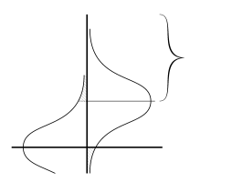

A Type I error would be any analysis that found a statistically significant sample correlation.  On the sample population curve, on the left side of the graph, the area that's shaded covers the sample correlations that would be Type I error.  That area is 5% of the total area “under” the sample population—that area will always be exactly equal to the area of the population probability curve that below the null line, because the two curves are identical in shape.  

When the sample probability curve is centered on the null line, the two curves are in perfect symmetry.  The area of one curve that is bounded by the bisecting line of the other curve is identical to the area of the other curve that is bounded by its bisecting line.

That the two areas are identical also simply makes sense.  A “95% confidence level” means that there is a 5% chance of a Type I error, so of course the part of the sample probability curve that would be a Type I error is 5%.

### Sideways Type II errors

The example graphic [figure NN] represents an extreme example of a Type II error.  It shows a linear regression done at a 95% confidence level, that has a statistical power of 90%.  

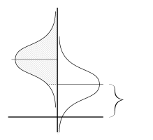

A Type II error would be any sample correlation that falls below the minimum statistically significant correlation, which is marked by the line that bisects the population probability curve on the right side of the graph.  Therefore, the area of the sample probability curve that is NOT shaded covers the sample correlations that would be a Type II error.

In contrast to the previous example, the next example graphic [figure NN] represents a much more common example of linear regressions in the social sciences.  It shows a linear regression done at a 95% confidence level, that has a statistical power of 50%. 

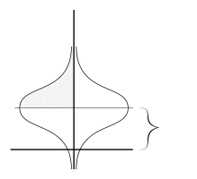

The area that is NOT shaded “under” the sample probability curve on the left side of the graph covers the sample correlations that would be a Type II error.  Hopefully that area looks disconcertingly large.  Because it is.

A statistical power of 50% means that there is a 50:50 chance of making a Type II error.  Which means that in the aggregated studies in some field, for every correlation reported as part of a linear regression with a 50% statistical power, there is another correlation that wasn't found and that wasn't reported, but that has just as strong of an effect as the correlation that did get reported.

Let's look again at the first example, to consider another implication of Type II errors.

If your sample correlation falls in the unshaded area on the left side of the graph, “under” the sample probability curve, your result is not statistically significant.  Therefore, it is generally considered unpublishable.  It's not viewed as a negative result, it's viewed as a non-result.

But is that appropriate?  If you calculate a statistical power of 90%, and then you fail to get a statistically significant sample correlation, there is a 10% that you just have bad luck.  But there's a 90% chance that there's something wrong with effect size you were expecting.  (Assuming you didn't merely make a mistake in the calculations along the way.)

For the purposes of calculating *statistical power*, you estimated the effect size based on one of two things:

1. The results of previous studies of the same correlation
1. The results of previous studies of related correlations, combined with accept theories about the relation between those correlations and the one you're studying

If you are doing a replication study, that's you used the first approach.  And when you failed to find a statistically significant result, that means that there's a 90% chance that those previous studies were wrong.

If you aren't doing a replication study, you likely used the second approach.  So, when you failed to find a statistically significant result, either the previous related studies were wrong, or the accepted theories that relates those studies to yours are wrong.

In any of those cases, a 90% chance would seem to be enough to warrant attention.  If a 95% confidence level is enough to get a positive result published, what's the required level of confidence in a negative result to get published?

There doesn't seem to be one.  The utility of negative results from studies with large statistical power remains largely unused.

## Conclusion

This document discussed four inter-related characteristics of linear regression analysis:

* confidence level
* statistical power
* sample size
* effect size

It used “sideways” graphics to keep those four concepts separate while showing how they are related to each other, and how changes in one characteristic will impact another.

As an example of how understanding those four based on the sideways graphics can be useful in understanding other issues related to linear regression, it briefly discussed why a Type II error may in fact be a valuable result, if the analysis had a large statistical power.

Hopefully you've found it helpful to look at statistics sideways.  

